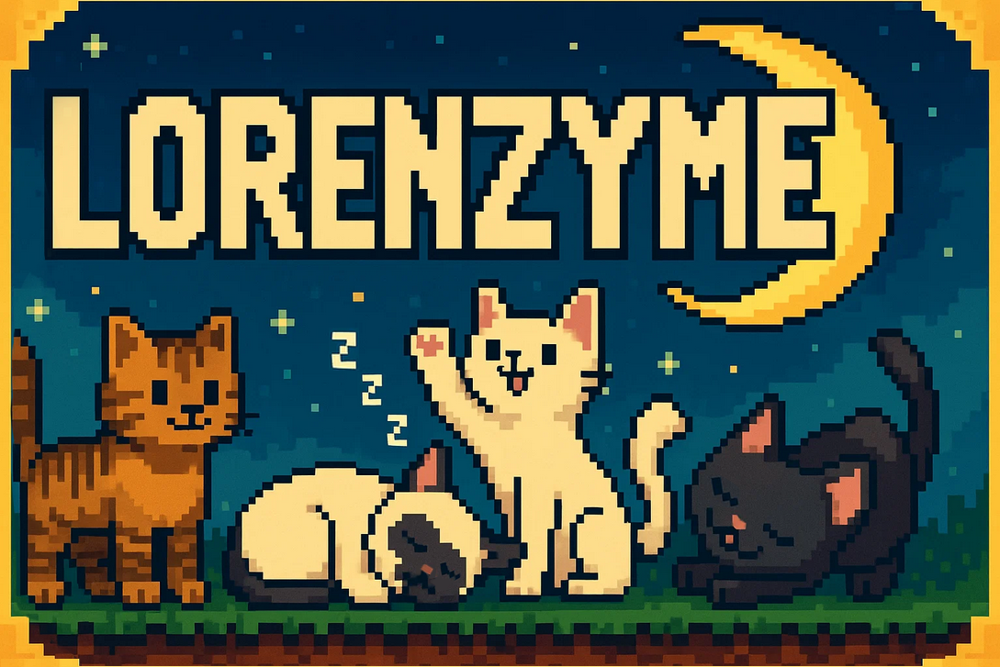

# 👋 Hi, I'm Lorenzo~!

I'm a passionate **full-stack developer** who loves building engaging, memorable experiences for people.  

- 👀 I’m super into digital art, tennis, hiking, music, traveling, and video games  
- 💞 I’m open to collaborating on graphical or code-based projects  
- 📬 Reach me at [lorenzo.gardner95@gmail.com](mailto:lorenzo.gardner95@gmail.com)  
- 🎨 Everything is not always `#000000` and `#FFFFFF`  

---

## 🧠 Tools & Tech I Love

<strong>🖥️ Frontend</strong>

  
  
  
  
  

<strong>⚙️ Backend & Databases</strong>

  
  
  
  
  

<strong>🮠Game Development</strong>

  
  
  
  

---

## 🎨 Design Stack

  
  
  
  

---

## 📊 GitHub Stats

  

---

## 🌟 Featured Work

- [**My Portfolio**](#): Built using React, TypeScript, and Framer Motion  
- [**Unity Platformer Demo**](#): A 2D platformer prototype in Unity (C#)  
- [**Flask REST API**](#): Python + Flask + PostgreSQL backend template
---

## 📫 Connect With Me

